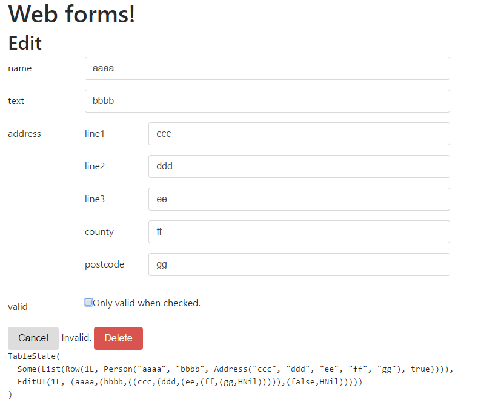

Status: Tiny experiments.

##So far
- Elm-Program: Make State/Action/view/update. Embed in a DOM node. Nest other ones by calling their view/update.
- `send: Action -> Unit` replaces `Cmd + Task + Sub + Html<Msg>`, call it from view (or init/update, or outside)
- Editor[T]: Derives an editor UI for a case class.
- AdminPanel: List, Create, Edit, Delete.

##Plans
- AdminPanel: Filters. Talk to web APIs.
- Routing: Navbar, URLs, inter-links on tables.
- Elm-Program: `send` replaces `Cmd + Task + Sub + Html<Msg>`
- Virtual-DOM:
  - scalatags-vdom: More annoying but it looks OK.
  - morphdom: Can't do oninput event!? I'd prefer one of these since it uses real DOM. 
  - if using real DOM, wrap in `Lazy` (takes args) + `Tree` (vdom it)
  - I still don't want to add `Html<Msg>`
- Servant-style Server & Client, but then also have a default ClientApp page for each (AdminPanel, WebSocket, ...)
